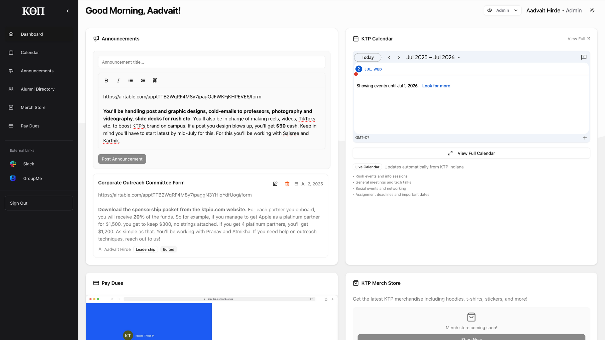
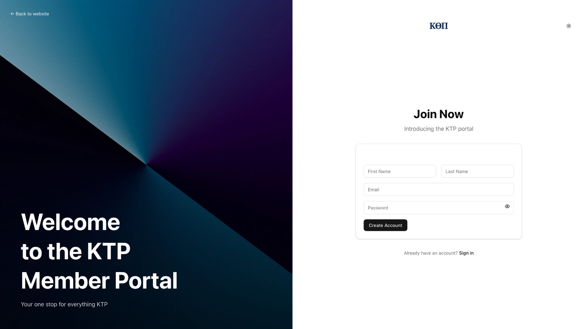
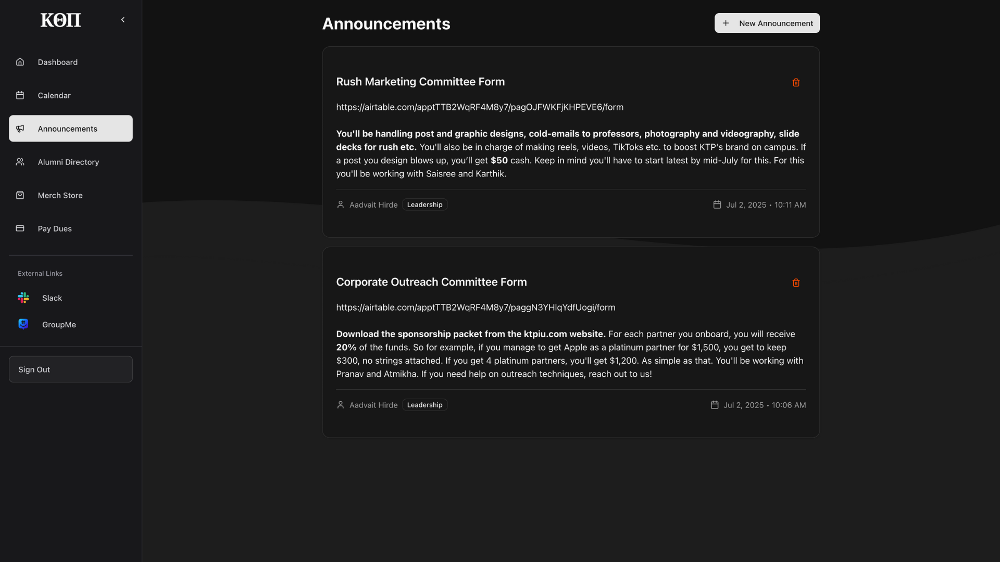

# Kappa Theta Pi - Alpha Eta Website

This is the official repository for Kappa Theta Pi - Alpha Eta's website, built with Next.js, TypeScript, and Tailwind CSS.

## Features

### Public Website
- Hero section with fraternity branding
- About section showcasing our mission
- Executive board profiles
- Alumni work showcase
- Rush information and FAQ
- Tech passion highlights
- Community impact section

### Member Portal
- **Dashboard**: Personalized welcome with role-based content
- **Calendar**: Integrated events and meetings
- **Announcements**: Role-based announcement system
- **Internships**: Daily-updated internship opportunities from top companies
- **Alumni Directory**: Member networking and connections
- **Dues Payment**: Streamlined payment system
- **Merchandise Store**: KTP branded items (coming soon)

## Internships Feature

The internships feature automatically pulls the latest internship opportunities from the [PrepAIJobs Summer 2026 Internships repository](https://github.com/PrepAIJobs/Summer2026-Internships) and presents them in an easy-to-browse format.

### Key Features:
- **Daily Updates**: Automatically refreshes internship data daily at 8 AM UTC
- **Search & Filter**: Filter by company, location, and work model (Remote/Hybrid/On Site)
- **Dashboard Widget**: Shows latest 3 internships on the member portal dashboard
- **Direct Applications**: One-click application links to company job portals
- **Real-time Statistics**: Shows total internships, companies, and remote positions

### Technical Implementation:
- **API Endpoint**: `/api/internships` fetches and parses the GitHub README markdown table
- **Caching**: 1-hour cache to reduce API calls and improve performance
- **Cron Job**: Vercel cron runs daily to refresh the cache
- **Error Handling**: Graceful fallbacks and loading states

## Tech Stack

- **Framework**: Next.js 14 with App Router
- **Language**: TypeScript
- **Styling**: Tailwind CSS with custom design system
- **UI Components**: Radix UI with custom theming
- **Authentication**: Clerk
- **Database**: Supabase
- **Deployment**: Vercel
- **External APIs**: GitHub API for internships data
